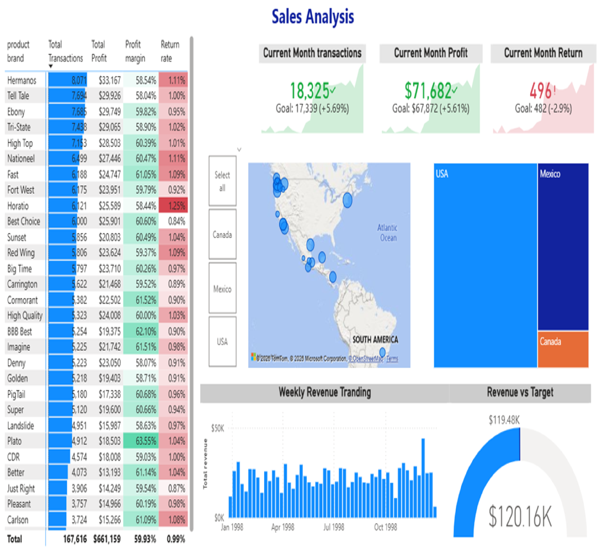

# Sales Analysis Dashboard | Power BI

## Project Overview

This project analyzes sales performance across multiple countries and product brands using Power BI.

The dashboard focuses on key business metrics such as revenue, profit, transaction volume, and return rates.

## Tools Used

- Power BI
- DAX
- Power Query
- Data Modeling
- Excel

## Key Metrics

- Revenue
- Profit
- Profit Margin
- Transaction Volume
- Return Rate

## Key Insight

The analysis showed that high transaction volume does not always lead to higher profitability. Some brands with strong sales had lower profit margins and higher return rates, reducing their overall business value.

This highlights the importance of evaluating multiple KPIs together instead of relying on a single metric.

## Dashboard Preview

## Files in this project

- Power BI Dashboard (.pbix)
- Dashboard Preview Image
